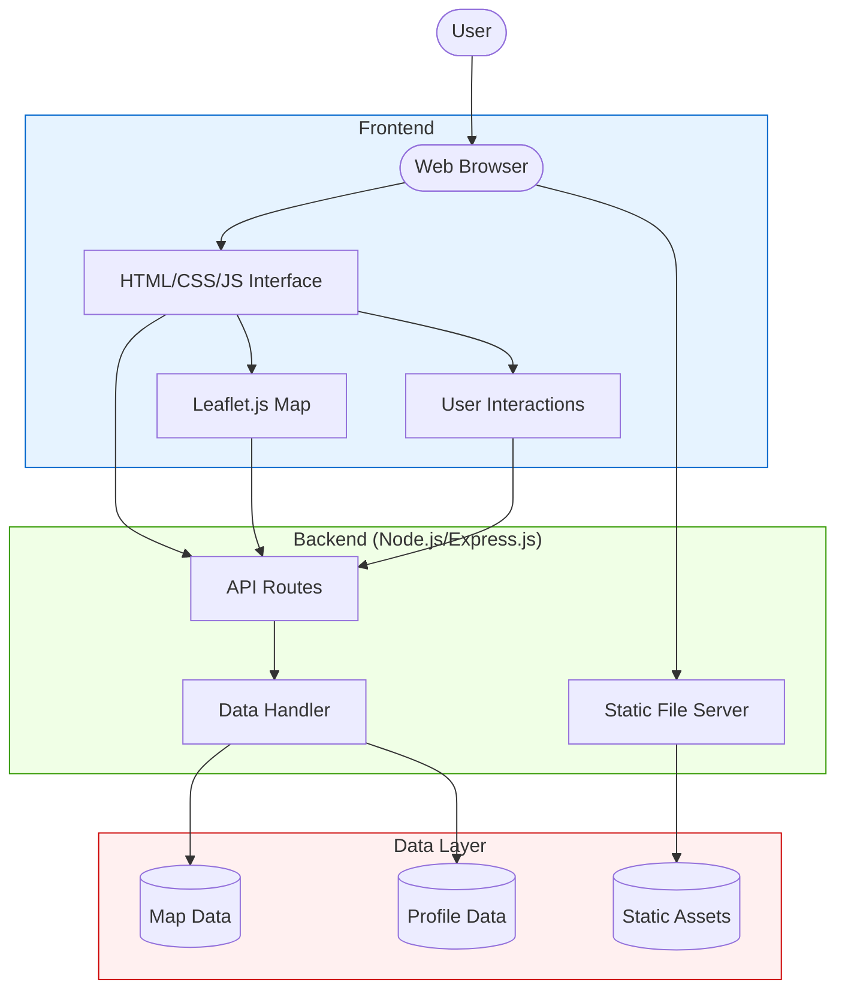

# Tesla and NVIDIA Bases Map

## Project Overview
This project visualizes the locations of Tesla and NVIDIA bases on an interactive map using Leaflet.js. It includes features such as tooltips with additional information and profile redirects.

## Owner
- **Name**: Niladri Das
- **X (Twitter)**: [@bniladridas](https://x.com/bniladridas)
- **GitHub**: [bniladridas](https://github.com/bniladridas)

## Table of Contents
- [Project Overview](#project-overview)
- [Owner](#owner)
- [Table of Contents](#table-of-contents)
- [Installation](#installation)
- [Usage](#usage)
- [Features](#features)
- [Technologies Used](#technologies-used)
- [Deployment](#deployment)
- [Architecture](#architecture)
- [License](#license)

## Installation
1. Clone the repository:
    ```bash
    git clone https://github.com/bniladridas/tesla-map-project.git
    ```
2. Navigate to the project directory:
    ```bash
    cd tesla-map-project
    ```
3. Install the dependencies:
    ```bash
    npm install
    ```

## Usage
1. Start the server:
    ```bash
    npm start
    ```
2. Open your browser and navigate to:
    ```
    http://localhost:3000
    ```

## Features
- Interactive map displaying Tesla and NVIDIA bases.
- Tooltips with additional information about each base.
- Profile redirects on logo hover.

## Technologies Used
- **Frontend**: HTML, CSS, JavaScript, Leaflet.js
- **Backend**: Node.js, Express.js
- **Other**: Git, GitHub

## Deployment
To deploy this project on Vercel:
1. Install the Vercel CLI:
    ```bash
    npm install -g vercel
    ```
2. Deploy the project:
    ```bash
    vercel
    ```

## Architecture


## License
This project is licensed under the MIT License. See the [LICENSE](LICENSE) file for details.
